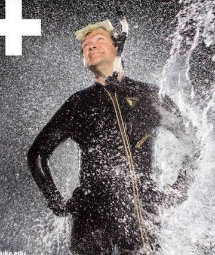

### Understanding the evolutionary novelties of the “fish that fed the Nation’s founders”
_Background_  
The American shad (_Alosa sapidissima_) is an anadromous fish distributed throughout the North American Atlantic coast, and prior to the 20th century, was one of the largest and most economically important fisheries in the U.S.  Adults spend most of their life at sea, and return in the spring to their natal streams to spawn.  This migratory behavior, like that of salmonids, is of particular interest to sensory biologists as the exact environmental cues employed to navigate to their natal areas remains unclear.  It has been demonstrated in salmonids that the geomagnetic field can be used to navigate, but whether or not shad utilize the same method is unknown.  American shad also have evolved several other unique features of interest to sensory biologists.  First, unlike most fish, shad lack a distinct lateral line (a critical electrophysiological and mechanosensory ‘organ’).  Second, shad can hear ultrasonic sounds up to 180 kHz (compared with 20 kHz in humans), one of the highest frequency ranges of any organism ever recorded and speculated to be a defense against cetacean echolocation (~40 – 150 kHz).  Despite the unique sensory features of American shad, very little research has focused on this species.  One reason is the lack of genetic and genomic resources available.  Not only will genomic resources facilitate evolutionary and functional studies of these unique sensory capabilities, but provide additional genetic resources to the wild fisheries managers to benefit the conservation and management of this important local resource.  

_Funding & Acknowlegements_  
This genome sequencing project is courtesy of an award from the [The Sequencing and Genomic Technologies Shared Resource](https://genome.duke.edu) at the Duke Center for Genomic and Computational Biology (Duke University). This project would also not have been possible if not for the samples and help provided by Stephen Jackson and Kevin Dockendorf at the [Edenton National Fish Hatchery](https://www.fws.gov/edenton/).

## Data
All project and sample information are publicly available and can be accessed through the NCBI BioProject database (accession [PRJNA487080](https://www.ncbi.nlm.nih.gov/bioproject/487080)).  All raw sequencing data have been deposited into NCBI and will be publicly available on 2019-09-15.  Please check back for updates on an earlier release.
- NCBI BioProject accession [PRJNA487080](https://www.ncbi.nlm.nih.gov/bioproject/487080)
- NCBI BioSample accession [SAMN09873042](https://www.ncbi.nlm.nih.gov/biosample/SAMN09873042)
- NCBI Sequence Read Archive (SRA)
  1.  Short-insert, paired end reads: SRR7973879
  2.  Long-insert, Mate-pair library (5-7 kb insert size): SRR7973880
  3.  Long-insert, Mate-pair library (10-12 kb insert size): SRR7973881

## Analysis Outline
Please follow the links below to get the code and associated descriptions for various analyses and data processing.
Some ancillary data files and custom scripts are available in the [Data](./Data) folder.

1. [Read Cleaning](./read-cleaning.md)
    - trimming, filtering, adapter removal, etc. for the raw sequencing reads.

## People

| Robert Fitak | Jay Wheeler | Sönke Johnsen |
| --- | --- | --- |
|  |  |  |
| Lead scientist, bioinformatician | Lab Manager, animal care, aspiring bioinformatician | Lab head, thinks it's cool |

_______________________________________________________
## License
### All code and content herein is licensed under:
### [GNU General Public License v3.0](./LICENSE)
