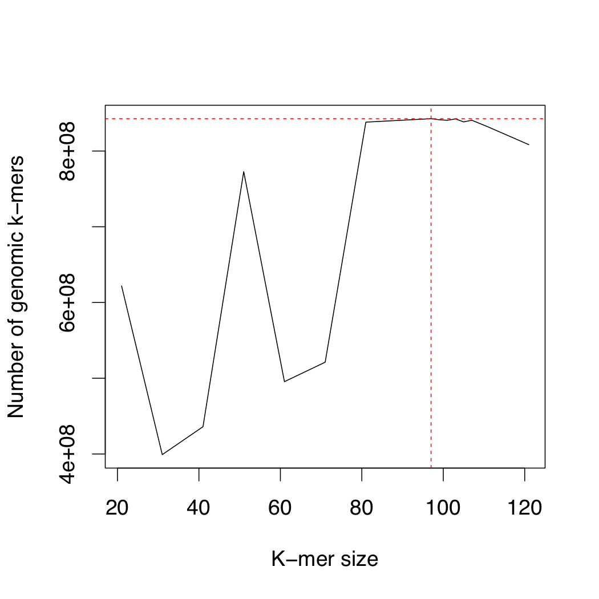

# Assembling the Genome
The steps to build the _de novo_ genome assembly include:
1. Estimating the best _k_-mer length for the assembly
    - Program: [KmerGenie v1.7051](http://kmergenie.bx.psu.edu)
2. Performing the assembly
    - Program: [Abyss v2.1.5](http://www.bcgsc.ca/platform/bioinfo/software/abyss)
    - Program: [Platanus v1.2.4](http://platanus.bio.titech.ac.jp/platanus-assembler/platanus-1-2-4)
3. Assembly clean-up and checking
    - Programs: xxx

## Step 1:  Estimating _k_-mer length
Prior to assembly, the first step is to select an appropriate _k_-mer length to use for the assembly.  Rather than running multiple assemblies at different vlaues for _k_, we will use the software [KmerGenie v1.7051](http://kmergenie.bx.psu.edu).
The publication can be found here:  
Chikhi R and Medvedev P (2014) Informed and automated k-mer size selection for genome assembly. _Bioinformatics_ 30(1): 31–37. https://doi.org/10.1093/bioinformatics/btt310

_Installation:_
```bash
# Install KmerGenie
wget http://kmergenie.bx.psu.edu/kmergenie-1.7051.tar.gz
tar -zxvf kmergenie-1.7051.tar.gz
cd kmergenie-1.7051/
make
```

_Run KmerGenie_  
Please see the script [kmergenie.sh](./Data/kmergenie.sh) for more details on Job information. According to KmerGenie, only reads used by the assembler, not those for scaffolding (i.e. mate pairs), should be used.
```bash
# Make list of sequence files
ls /work/frr6/SHAD/MUSKET/PE500*.fq.gz > reads.list

# Run kmergenie
kmergenie \
   reads.list \
   --diploid \
   -t 12 \
   -o kmer
```
_Parameters Explained:_
- reads.list :: file with list of reads files to include, one per line. (does/not recognize gzipped files)
- --diploid :: diploid organism
- -t :: number of cpus to use
- -o :: output file prefix

_See the Output HTML/PDF Files:_
- [kmergenie_report](./Data/kmergenie_report.pdf)

_Summary of Results:_
KmerGenie reported:
1.  An estimated best ___k_=97__
2.  An estimated genome size of __842,670,695 bp__
3.  See the plot below:



## Step 2a: Assembly with Abyss 2.1.5
From the website:
"ABySS is a de novo, parallel, paired-end sequence assembler that is designed for short reads. The single-processor version is useful for assembling genomes up to 100 Mbases in size. The parallel version is implemented using MPI and is capable of assembling larger genomes."  I have used it previously to assemble the dromedary and Florida panther genomes. The publications can be found here:
- Jackman SD, Vandervalk BP, Mohamadi H, Chu J, Yeo S, Hammond SA, Jahesh G, Khan H, Coombe L, Warren RL, and Birol I (2017) ABySS 2.0: resource-efficient assembly of large genomes using a Bloom filter. _Genome Research_ 27: 768-777. https://doi.org/10.1101/gr.214346.116
- Simpson JT, Wong K, Jackman SD, Schein JE, Jones SJ, Birol I. (2009) ABySS: A parallel assembler for short read sequence data. _Genome Research_ 19: 1117-1123. https://doi.org/10.1101/gr.089532.108

_Installation:_
```bash
# Install google sparsehash
git clone https://github.com/sparsehash/sparsehash.git
cd sparsehash/
./configure --prefix=/dscrhome/frr6/bin/
make
make install

# Install Abyss v2.1.5
wget http://www.bcgsc.ca/platform/bioinfo/software/abyss/releases/2.1.5/abyss-2.1.5.tar.gz
tar -zxvf abyss-2.1.5.tar.gz
cd abyss-2.1.5/
./configure \
   --prefix=/dscrhome/frr6/bin/ \
   --with-sparsehash=/dscrhome/frr6/bin \
   --with-mpi=/opt/apps/slurm/openmpi-2.0.0/
make
make install
```

_Run Abyss_  
Please see the script [abyss.sh](./Data/abyss.sh) for more details on Job information.  Abyss was run by varying several parameters found in the file [parameters](./Data/parameters).
```bash
# Setup TMPDIR
export TMPDIR=/work/frr6

# This is a basic command for abyss:
abyss-pe \
   k=${k} \
   G=1300000000 \
   S=${S} \
   s=${s} \
   np=12 \
   v=-v \
   name=Asap${n} \
   lib='PE500' \
   mp='MP5k MP10k' \
   PE500='/work/frr6/SHAD/MUSKET/PE500_F.trimmed.uniq.noMito.corrected.fq.gz /work/frr6/SHAD/MUSKET/PE500_R.trimmed.uniq.noMito.corrected.fq.gz' \
   MP5k='/work/frr6/SHAD/MUSKET/MP5k_F.trimmed.uniq.unj.noMito.corrected.fq.gz /work/frr6/SHAD/MUSKET/MP5k_R.trimmed.uniq.unj.noMito.corrected.fq.gz' \
   MP10k='/work/frr6/SHAD/MUSKET/MP10k_F.trimmed.uniq.unj.noMito.corrected.fq.gz /work/frr6/SHAD/MUSKET/MP10k_R.trimmed.uniq.unj.noMito.corrected.fq.gz'
```
_Parameters Explained:_
- k :: _k_-mer length for the assembly
- G :: genome size estimate for NG50, 1.3 pg (~1.3 Gb) for _A. sapidissima_
    - Taken from [genomesize.com](http://www.genomesize.com/result_species.php?id=2065)
    - Hinegardner R and Rosen DE (1972) Cellular DNA Content and the Evolution of Teleostean Fishes. _American Naturalist_ 106(951): 621-644. https://www.jstor.org/stable/2459724
- -n :: print out the complete list of commands to run (dry run)
- v=-v :: verbose output
- name :: name of assembly
- lib :: name of PE library
- mp :: name(s) of mate-pair libraries
- ... :: lists of the files in each library

_Summary of Abyss Assemblies at Various Parameters:_  

| Parameter | Abyss1 | Abyss2 | Abyss3 | Abyss4 | Abyss5 | Abyss6 | Abyss7 | Abyss8 | Abyss9 | Abyss10 | Abyss11 |
| --- | --- | --- | --- | --- | --- | --- | --- | --- | --- | --- | --- |
| k | 97 | 97 | 97 | 51 | 51 | 61 | 61 | 71 | 71 | 81 | 81 |
| G | 1300000000 | 1300000000 | 900000000 | 1300000000 | 1300000000 | 1300000000 | 1300000000 | 1300000000 | 1300000000 | 1300000000 | 1300000000 |
| s | 200 | 500 | 1000 | 1000 | 200 | 1000 | 200 | 1000 | 200 | 1000 | 200 |
| c | sqrt(median) | sqrt(median) | sqrt(median) | sqrt(median) | sqrt(median) | sqrt(median) | sqrt(median) | sqrt(median) | sqrt(median) | sqrt(median) | sqrt(median) |
| n:500 | 342,115 | 218,851 | 250,927 | 287,606 | 305,924 | 277,688 | 299,210 | xxx | xxx | xxx | xxx |
| L50 | 52,889 | 34,953 | 35,126 | 45,830 | 49,880 | 41,175 | 45,702 | xxx | xxx | xxx | xxx |
| N50 | 5,156 | 6,085 | 5,839 | 2,709 | 2,776 | 3,456 | 3,588 | xxx | xxx | xxx | xxx |
| Longest | 94,534 | 82,529 | 82,529 | 51,495 | 52,621 | 51,485 | 52,620 | xxx | xxx | xxx | xxx |
| Total Size | 972.3 Mb | 696.3 Mb | 676.5 Mb | 508.2 Mb | 572.2 Mb | 559.8 Mb | 643.5 Mb | xxx | xxx | xxx | xxx |

| Parameter | Abyss1 | Abyss2 | Abyss3 | Abyss4 |
| --- | --- | --- | --- | --- |
| k | 97 | 97 | 97 | xxx |
| G | 1300000000 | 1300000000 | 900000000 | 1300000000 |
| s | 1000 | 1000 | 1000 | 1000 |
| c | sqrt(median) | sqrt(median) | 2 | sqrt(median) |
| n:500 | 250,927 | xxx | 267,319 | xxx |
| L50 | 35,128 | xxx | 37,850 | xxx |
| N50 | 5,839 | xxx | 5,190 | xxx |
| Longest | 82,529 | xxx | 82,529 | xxx |
| Total Size | 676.5 Mb | xxx | 665.7 Mb | xxx |

## Step 2b: Assembly with Platanus v1.2.4
Platanus is another assembler built specifically to assemble genomes from high coverage data.  You can perform all the necessary read trimming/cleaning using platanus_trim, but we have already conservatively trimmed our dataset.  From the website:
- Compared with other major assemblers, Platanus assembler was designed to provide good results when using higher coverage data. The optimal coverage depth for Platanus is approximately >80. In some procedures, Platanus attempts to assemble each haplotype sequence separately. In other words, Platanus requires twice as high coverage sequences as other assemblers. This is the main reason why Platanus requires high coverage. You can find more details on Supplemental Materials page 68–74 of our Genome Research publication.
- To get good statistical results, mate-pair library sequences are indispensable. We received many claims and questions of poor assembling results. However, in almost all cases, only paired-end sequences were inputted. Except in the case of assembling very simple and small size genomes, it is impossible to get good results without using a mate-pair library.
- The publication can be found here:
    - Kajitani R, Toshimoto K, Noguchi H, Toyoda A, Ogura Y, Okuno M, Yabana M, Harada M, Nagayasu E, Maruyama H, Kohara Y, Fujiyama A, Hayashi T, and Itoh T (2014) Efficient _de novo_ assembly of highly heterozygous genomes from whole-genome shotgun short reads. _Genome Research_ 24(8):1384-1395. https://doi.org/10.1101/gr.170720.113

_Installation:_
```bash
wget http://platanus.bio.titech.ac.jp/?ddownload=150
tar -zxvf Platanus_v1.2.4.tar.gz
cd Platanus_v1.2.4
make

# Or download pre-built binary directly from http://platanus.bio.titech.ac.jp/platanus-assembler/platanus-1-2-4
```
_Run Platanus:_
Please see the script [platanus.sh](./Data/platanus.sh) for more details on Job information.
```bash
# Make uncompressed reads files
zcat PE500_F.trimmed.uniq.noMito.corrected.fq.gz > F.fq
zcat PE500_R.trimmed.uniq.noMito.corrected.fq.gz > R.fq

# Run platanus
platanus \
   assemble \
   -o Asap1 \
   -f [FR].fq \
   -t 16 \
   -m 200

# Remove read files
rm F.fq R.fq
```
_Parameters Explained:_
- -o :: name prefix for output files
- -f :: read files *__DOES NOT READ GZIPPED FILES!__*
- -t :: number of threads
- -m :: memory to use
